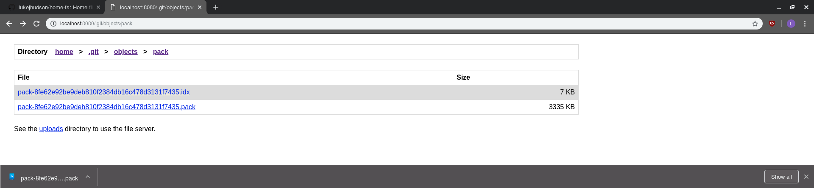
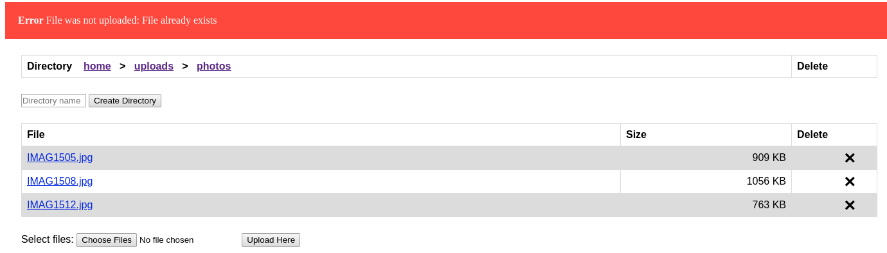
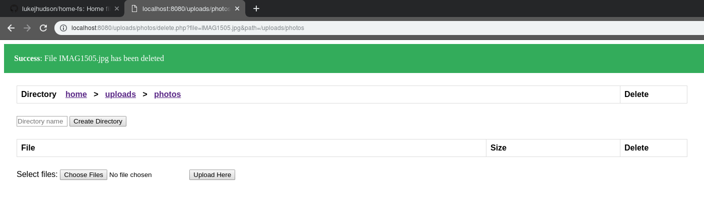

# home-fs
# home-fs - A Basic, Lightweight File Server #
## About ##
A lightweight file server built in C from the ground up, intended for use on a Raspberry Pi. This project is based on an assignment from my third year of university. Browse files and directories on the server, or upload your own files in the 'uploads' folder.

## Learning Outcomes ##

The university assignment that this project is based on included the multi-threaded server and some basic file and directory navigation through a web browser. The documentation in the /doc folder is from this original assignment. My intention for this project was to take the idea further and experiment with the full stack of web development. Just like the original assignment, I did not use an IDE and instead used gedit, a simple text editor, in order to gain more confidence in programming in C. This meant that I had to be very careful and have a good understanding of memory management, pointers and what types were being passed around, rather than relying on an IDE to handle most of this for me. Using tools such as Valgrind helped me to track down memory management errors and understand why the errors occurred and how to solve them.

At the core of the project I had to become familiar with HTTP protocols so that I could fully understand what information browsers send and what they expect to receive when displaying a web page. This meant learning about the different kinds of HTTP headers, and constructing and parsing valid HTTP packets. In addition, I had to learn how to correctly handle errors without terminating the connection or crashing the server, and then pass relevant information to the user in order to resolve the error. For example, the network pipeline would break if the user cancelled an upload or download while it was in progress. The thread handling the connection therefore had to be configured to handle the associated SIGPIPE signal to reset or close the connection gracefully, rather than being forcefully closed and taking the server down with it.

One of the main purposes of this project was to experiment with and gain a decent level of understanding for the full stack of web development. Prior to this project I had very little experience in using HTML, CSS and PHP. I enjoyed my time creating and formatting web pages with HTML and CSS to make the site simple, attractive and usable. Web pages had to be created dynamically since the content of a page depends on the files or directories that are present in the directory currently being viewed. Therefore HTML (e.g. rows of the tables) had to be automatically generated based on what was found in the directory, and learning how to format this data and apply styling to it aided in providing me with a good understanding of HTML and CSS. 

More complex user actions, such as uploading or deleting files, had to be handled using PHP. I found PHP to be quite a powerful and simple language, but executing it on my custom server presented a challenge. The solution I created was to run a PHP server locally alongside the main server. When the user requests the use of a PHP file, the server parses the request and passes it on to the PHP server to be executed. The server then passes the response from the PHP server to the user in the form of a banner at the top of the page. This solution covered the full stack of web development and helped my understanding of each aspect of the file server immensely. 

## Tour of the Software ##

The home page shows files and directories at the top level of the file system. It is not possible to access any files or directories outside of those presented here.

Click the links to navigate through the file system. Files and directories are ordered alphabetically, and the size of a file is shown next to it. Click the name of a file to download or open it. Files such as images or text files will open in the browser.

Files that are unsupported by your browser will instead be automatically downloaded.

Files can only be uploaded inside the 'uploads' folder. In here, files to upload can be selected using the 'Choose Files' button at the bottom of the screen. This will open a standard file browser, allowing you to select the file(s) to upload. Once selected, press the 'Upload Here' button to upload the files into the directory currently being viewed.

When a file has been uploaded, the page will refresh and a banner will be displayed at the top of the page. This banner shows whether or not the file was successfully uploaded, and can be closed by clicking the 'X' on the far right of the banner.

Helpful error messages can also be displayed in the banner:

Directories can be created inside the 'uploads' folder (and within any directories inside) by entering the name of the directory in the 'Directory name' text box and then pressing the 'Create Directory' button.

User-created directories can also be deleted by clicking the 'X' in the 'Delete' column of the table. This will bring up a confirmation box, and the directory will only be deleted if the 'OK' button is clicked. 

Uploaded files can be deleted in a similar manner. Click the 'X' in the 'Delete' column of the file you wish to delete. A confirmation box will appear, and the 'OK' button must be clicked in order to delete the file.

