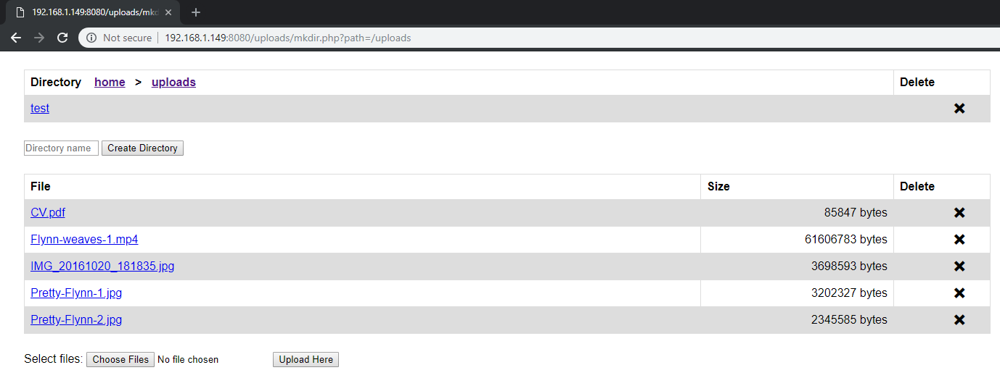
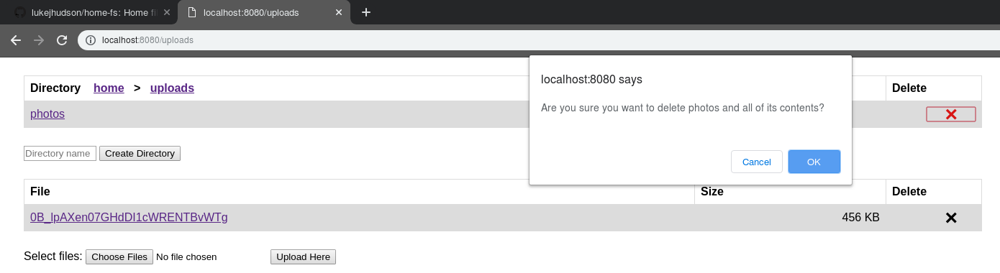
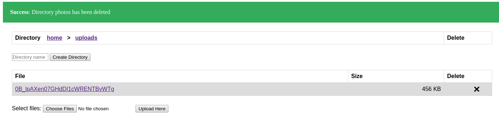

# home-fs
A lightweight file server built in C from the ground up, intended for use on a Raspberry Pi. This project is based on an assignment from my third year of university. Browse files and directories on the server, or upload your own files in the '/uploads' folder.

The home page shows files and directories at the top level of the file system. It is not possible to access any files or directories outside of those presented here.

Click the links to navigate through the file system. Files and directories are ordered alphabetically, and the size of a file is shown next to it. Click the name of a file to download or open it. Files such as images or text files will open in the browser.

Files that are unsupported by your browser will instead be automatically downloaded.

Files can only be uploaded inside the 'uploads' folder. In here, files to upload can be selected using the 'Choose Files' button at the bottom of the screen. This will open a standard file browser, allowing you to select the file(s) to upload. Once selected, press the 'Upload Here' button to upload the files into the directory currently being viewed.

When a file has been uploaded, the page will refresh and a banner will be displayed at the top of the page. This banner shows whether or not the file was successfully uploaded, and can be closed by clicking the 'X' on the far right of the banner.

Helpful error messages can also be displayed in the banner:

Directories can be created inside the 'uploads' folder (and within any directories inside) by entering the name of the directory in the 'Directory name' text box and then pressing the 'Create Directory' button.

User-created directories can also be deleted by clicking the 'X' in the 'Delete' column of the table. This will bring up a confirmation box, and the directory will only be deleted if the 'OK' button is clicked. 

Uploaded files can be deleted in a similar manner. Click the 'X' in the 'Delete' column of the file you wish to delete. A confirmation box will appear, and the 'OK' button must be clicked in order to delete the file.

